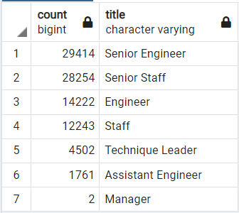

Pewlett Hackard 
# The silver tsunami analysis

## Overview

Pewlett Hackard has a workforce of 240,124 employees, the retirement date for 33,118 employees is coming soon, a 13.79% of their workforce. It's mandatory to make a plan to fill out the vacancies that the retired employees will left.

### Summary of employees by department

###### Total 240,124 employees   

The employees who will retire are those who  

- They were born between January 1, 1952 and December 31, 1955.
- They were hired between January 1, 1985 and December 31, 1988.
- They are working in the company 

### Summary of employees to retire by department

###### Total: 33,118 employees

## Results
For better planning, the analysis displays a table that summarizes the employees who will retire by title. In this way, the human resources department will be able to have a vision of which position will have vacancies.

### Summary of employees to retire by title

###### Total: 90,398 employees

    Note: The query for this doesn't filter by hire date or active working. Total employees: 90,398. The employee number may not match the number of employees to retire

        SELECT e.emp_no,
            e.first_name,
            e.last_name,
            tl.title,
            tl.from_date,
            tl.to_date
        INTO retirement_titles	   
        FROM employees as e
        INNER JOIN  titles as tl
        ON (e.emp_no = tl.emp_no)
        WHERE (e.birth_date BETWEEN '1952-01-01' AND '1955-12-31')
        ORDER BY e.emp_no; 

        SELECT DISTINCT ON (rt.emp_no) rt.emp_no,
            rt.first_name,
            rt.last_name,
            rt.title
        INTO retirement_Uniq_titles
        FROM retirement_titles as rt
        ORDER BY rt.emp_no, rt.to_date DESC;

        SELECT COUNT(rut.title), rut.title
        INTO retiring_titles
        FROM retirement_uniq_titles as rut
        GROUP BY rut.title
        ORDER BY COUNT(rut.title) DESC;

For a better view the next table is filter by department by title, and by hire date or active working

### Summary of employees to retire by deparment by title

###### Total: 33,118 employees

    Query:
        SELECT count(e.first_name),
            d.dept_name,
            tl.title
        INTO retirement_resume_dept_title
        FROM employees as e
        INNER JOIN dept_emp as de
        ON (e.emp_no = de.emp_no)
        INNER JOIN departments AS d
        ON (de.dept_no = d.dept_no)
        INNER JOIN retirement_uniq_titles as tl
        ON (e.emp_no = tl.emp_no)
        WHERE (e.birth_date BETWEEN '1952-01-01' AND '1955-12-31')
        AND (e.hire_date BETWEEN '1985-01-01' AND '1988-12-31')
        AND (de.to_date = '9999-01-01')
        GROUP by (d.dept_no,tl.title)
        ORDER BY (d.dept_no, tl.title);

## Summary
To facilitate the process of filling vacancies, the human resources department decides to create a mentoring program. The list of possible employees who comply with the filter is created, having been born in 1965 and working in the company

### Mentorship program

###### Total: 1,549 employees

[Download the file](https://github.com/cgzverduzco/Pewlett-Hackard-Analysis-Challenge/blob/main/Data/mentorship_eligibilty.csv)